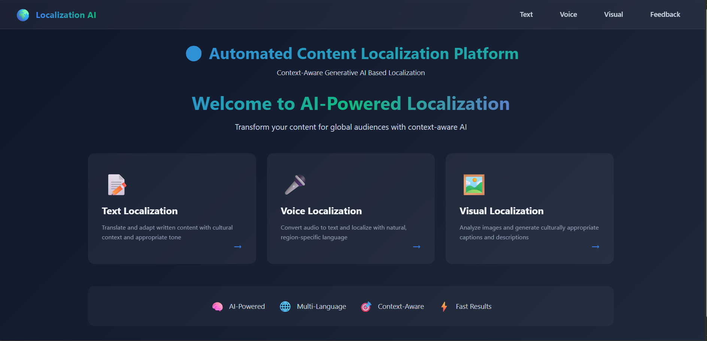

# 🌍 Automated Content Localization Platform

An AI-powered localization platform that adapts **Text, Voice, and Visual Content** for different languages, cultures, and regions using **Generative AI, OCR, and Speech Processing**.

This project was developed as a **Mini Project (AIML) 2025-2026** using **Flask, Gemini API, EasyOCR, Speech Recognition, and AI-based localization techniques**.

---

# 📌 Project Overview

The **Automated Content Localization Platform** helps users localize different types of content:

- 📝 Text Localization
- 🎤 Voice Localization
- 🖼️ Visual Localization

The system provides:
- AI-generated multilingual localization
- Region-specific cultural adaptation
- OCR-based text extraction from images
- Speech-to-Text and Text-to-Speech conversion
- Tone-aware content generation

---

# 🚀 Features

## ✅ Text Localization
- Translate and localize text
- Supports multiple tones
- Region-aware adaptation
- AI-generated culturally relevant output

---

## ✅ Voice Localization
- Upload audio files
- Speech-to-Text conversion
- AI localization processing
- Text-to-Speech generated localized audio

---

## ✅ Visual Localization
- Upload image files
- OCR text extraction using EasyOCR
- Detect image context
- Generate localized captions and UI text
- Cultural notes generation

---

# 🛠️ Tech Stack

## Backend
- Python
- Flask

## Frontend
- HTML
- CSS
- JavaScript
- Jinja2 Templates

## AI Integration
- Google Gemini API

## OCR & Image Processing
- EasyOCR
- Pillow (PIL)
- OpenCV

## Voice Processing
- SpeechRecognition
- gTTS
- pydub

---

# 📂 Project Structure

```bash
Automated-Content-Localization/
│
├── app.py
├── requirements.txt
├── README.md
├── .env
├── .gitignore
├── image.jpeg
├── activate.bat
├── library_list.txt
│
├── services/
│   ├── gemini_service.py
│   ├── voice_service.py
│   ├── visual_service.py
│   └── ocr_service.py
│
├── templates/
│   ├── home.html
│   ├── text.html
│   ├── visual.html
│   ├── voice.html
│   ├── result.html
│   └── feedback.html
│
├── static/
│   ├── css/
│   ├── uploads/
│   └── outputs/
│
├── instance/
│
└── Visual-Backend/
```

---

# ⚙️ Installation Setup

## 1️⃣ Clone Repository

```bash
git clone <repository-link>
cd MINI_PROJECT_2Y-MAIN
```

---

## 2️⃣ Create Virtual Environment

### Windows

```bash
python -m venv venv
venv\Scripts\activate
```

### Linux / Mac

```bash
python3 -m venv venv
source venv/bin/activate
```

---

## 3️⃣ Install Dependencies

```bash
pip install -r requirements.txt
```

---

# 🔑 API Configuration
   
This project uses the **Google Gemini API** for AI-based localization.

## Create `.env` File

Create a `.env` file in the project root directory.

Example:

```env
GOOGLE_API_KEY=your_gemini_api_key_here
```

---

## Get Gemini API Key

1. Visit:
   https://aistudio.google.com/app/apikey

2. Generate your API Key

3. Copy and paste it inside the `.env` file

---

# ▶️ Run the Project

Start the Flask application:

```bash
python app.py
```

Open browser:

```bash
http://127.0.0.1:5000/
```

---

# 🌐 Supported Modules

## 📝 Text Localization

### Input
- Original Text
- Target Language
- Region / Culture
- Tone

### Output
- Localized Text
- Cultural Adaptation

---

## 🎤 Voice Localization

### Input
- Audio File / Voice Recording
- Target Language
- Region
- Tone

### Output
- Transcribed Text
- Localized Voice Output
- Generated Audio File

---

## 🖼️ Visual Localization

### Input
- Image Upload
- Optional Caption / UI Text
- Target Language
- Tone

### Output
- Extracted OCR Text
- Localized Visual Caption
- Cultural Notes

---

# 🎭 Supported Tones

## Text Module
- Formal
- Casual
- Marketing
- Narrative
- Professional

## Visual Module
- Formal
- Casual
- Professional
- Friendly

---

# 🧠 Working Flow

## Text Localization Flow

```text
User Input
   ↓
Gemini AI Processing
   ↓
Localization Generation
   ↓
Cultural Adaptation
   ↓
Final Output
```

---

## Voice Localization Flow

```text
Audio Upload
   ↓
Speech-to-Text
   ↓
AI Localization
   ↓
Text-to-Speech
   ↓
Localized Voice Output
```

---

## Visual Localization Flow

```text
Image Upload
   ↓
OCR Text Extraction
   ↓
Image Context Understanding
   ↓
AI Localization
   ↓
Localized Visual Output
```

---

# 📸 Preview

## Home Page Preview



---

# 🔍 Example Use Cases

- Educational content localization
- Voice translation systems
- Multilingual customer support
- Marketing localization
- Visual content adaptation
- Regional UI localization

---"# Automated_Content_Localization" 
